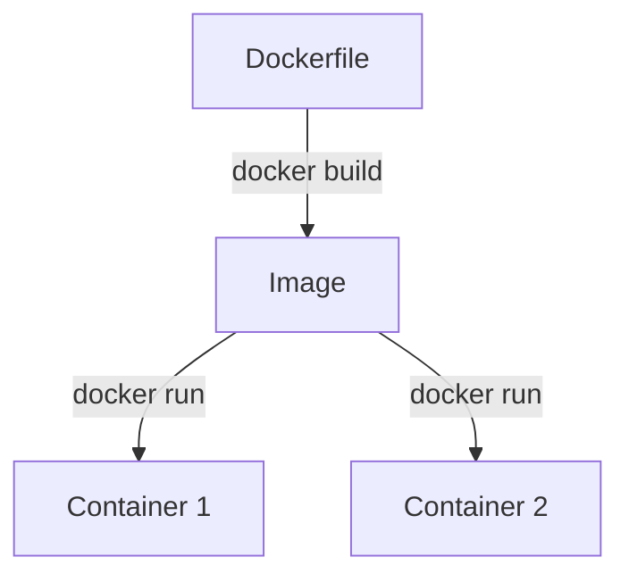
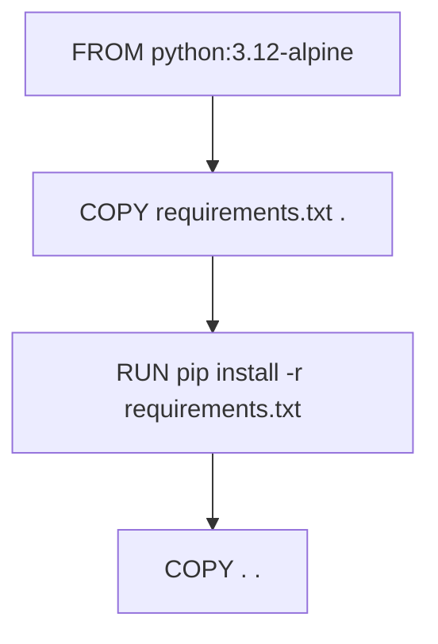

# Docker Fundamentals

Core concepts behind images, containers, and how Docker builds them.

## Image vs Container

- **Image** — a read-only template made of stacked filesystem layers.
- **Container** — a running instance of an image, with its own writable layer, process, and network namespace.

Multiple containers can run from the same image, completely independent of each other.



## Layers & Build Cache

Each Dockerfile instruction creates a cached layer. If nothing above it changed, Docker reuses the cache instead of rebuilding.



Copying dependency files before source code keeps the slow install step cached across code changes.

## Common Instructions

| Instruction | Purpose |
|---|---|
| `FROM` | Base image |
| `WORKDIR` | Sets working directory |
| `COPY` | Adds files to the image |
| `RUN` | Executes a command at build time |
| `EXPOSE` | Documents the listening port (not enforced) |
| `CMD` | Default command on container start |

## IMPORTANT

- `EXPOSE` doesn't publish a port — `-p` or `ports:` does.
- `docker ps` only shows running containers; use `-a` for all.
- Rebuilding an image doesn't affect containers already running from the old one.

## Useful Commands

```bash
docker build -t myapp:latest .
docker run -d -p 8080:80 myapp:latest
docker ps -a
docker logs <container>
docker exec -it <container> sh
docker system prune
```