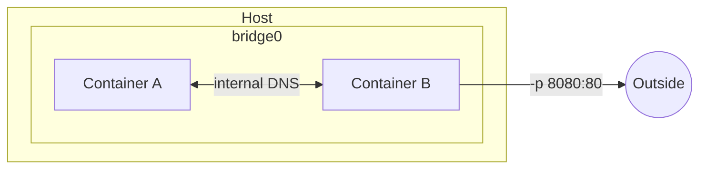

# Networking

How containers talk to each other, the host, and the outside world.

## Network Drivers

| Driver | Use case |
|---|---|
| `bridge` | Default; isolated network on a single host |
| `host` | Container shares the host's network stack directly |
| `none` | No networking |
| `overlay` | Multi-host networking (Swarm/multi-node setups) |

## Default Bridge Network



Containers on the same user-defined bridge network can reach each other by service/container name — Docker's built-in DNS resolves it. The default `bridge` network (unnamed) does **not** provide this; only custom networks do.

## Port Publishing

`-p <host_port>:<container_port>` maps a host port to a container port. Without it, the container is reachable only from other containers on the same network, not from the host or outside world.

## Watch out for

- The default `bridge` network doesn't resolve container names — create a custom network if you need that.
- `host` mode skips network isolation entirely; ports bind directly to the host, no `-p` needed or possible.
- Two containers on different networks can't reach each other unless one is attached to both.

## Useful Commands

```bash
docker network ls
docker network create mynet
docker network inspect mynet
docker run --network mynet --name app1 myimage
docker network connect mynet existing_container
```