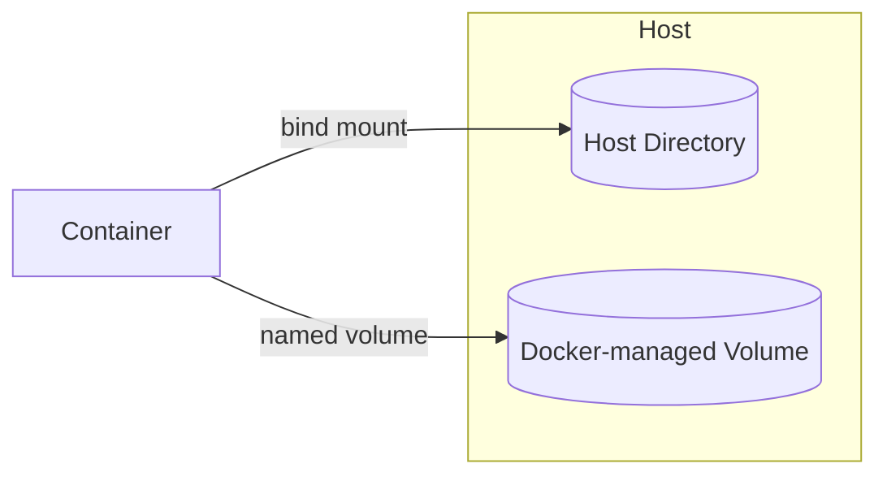

# Volumes & Storage

How container data persists (or doesn't) beyond the container's lifecycle.

## The Problem

A container's writable layer is deleted when the container is removed. Any data written there — logs, uploads, a database's files — goes with it unless it's explicitly persisted.

## Bind Mounts vs Named Volumes

| | Bind Mount | Named Volume |
|---|---|---|
| Location | A specific path on the host | Managed by Docker (`/var/lib/docker/volumes/...`) |
| Use case | Local dev, sharing config/code | Persistent app data (databases, uploads) |
| Portability | Tied to host filesystem layout | Portable across environments |



## Syntax

```bash
# Bind mount
docker run -v /host/path:/container/path myimage

# Named volume
docker run -v myvolume:/container/path myimage
```

In `docker-compose.yml`:

```yaml
services:
  db:
    image: postgres:16
    volumes:
      - db-data:/var/lib/postgresql/data

volumes:
  db-data:
```

## Common confusions

- Removing a container with `docker rm` does not delete named volumes by default — use `docker rm -v` or `docker volume rm` explicitly.
- Bind mount paths must exist on the host, or Docker creates an empty directory silently — easy to miss a typo.
- Data written to a path that isn't mounted is gone the moment the container is removed.

## Useful Commands

```bash
docker volume ls
docker volume inspect myvolume
docker volume rm myvolume
docker volume prune
```