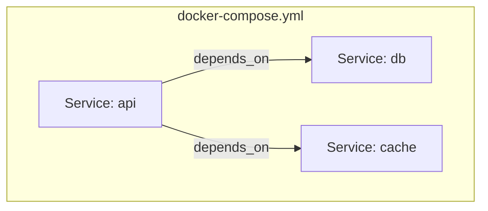

# Docker Compose — Multi-Container Setups

Defining and running multiple related containers as a single stack.

## Why Compose

Running multiple containers by hand means tracking networks, volumes, environment variables, and start order manually. Compose puts all of it in one YAML file and brings the whole stack up or down with one command.



## Core Structure

```yaml
version: "3.8"

services:
  api:
    build: ./api
    ports:
      - "8080:8080"
    environment:
      - DB_HOST=db
    depends_on:
      - db

  db:
    image: postgres:16
    volumes:
      - db-data:/var/lib/postgresql/data

volumes:
  db-data:
```

## Key Fields

| Field | Purpose |
|---|---|
| `build` | Build an image from a local Dockerfile |
| `image` | Use an existing image instead of building |
| `ports` | Publish container ports to the host |
| `environment` | Set environment variables |
| `depends_on` | Control startup order (not readiness) |
| `volumes` | Attach named volumes or bind mounts |
| `networks` | Attach to a custom network |

## Watch out for

- `depends_on` controls start **order**, not whether the dependency is actually ready — a DB container can be "started" but not yet accepting connections. Use health checks for real readiness.
- Services on the same Compose file share a default network automatically — no manual network setup needed.
- Changing a Dockerfile doesn't rebuild automatically; use `--build`.

## Useful Commands

```bash
docker compose up -d
docker compose up --build
docker compose ps
docker compose logs -f <service>
docker compose down
docker compose down -v   # also removes volumes
```