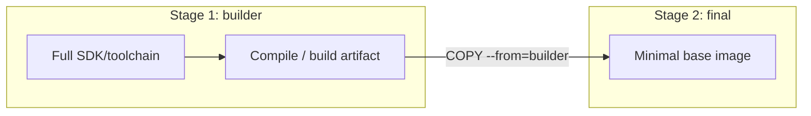

# Image Optimization & Security

Keeping images small, fast to pull, and reasonably hardened.

## Multi-Stage Builds

Separates the build environment from the runtime environment — compilers, dev dependencies, and build tools never make it into the final image.



```dockerfile
# Stage 1 — build
FROM golang:1.22 AS builder
WORKDIR /src
COPY . .
RUN go build -o app .

# Stage 2 — runtime
FROM alpine:3.19
COPY --from=builder /src/app /app
CMD ["/app"]
```

## Base Image Choice

| Base | Typical size | Notes |
|---|---|---|
| `ubuntu` | ~70MB+ | Full-featured, larger |
| `debian-slim` | ~30MB | Trimmed but familiar tooling |
| `alpine` | ~5MB | Minimal, uses musl libc (can affect compatibility) |
| `distroless` | Smallest | No shell, no package manager — hardest to debug |

## Security Basics

- Run as a non-root user (`RUN adduser` + `USER appuser`) rather than the default root.
- Use `.dockerignore` to keep secrets, `.git`, and local env files out of the build context.
- Pin base image versions (`python:3.12-alpine`, not `python:latest`) for reproducible builds.
- Scan images for known vulnerabilities before pushing to a shared registry.

## Watch out for

- Alpine's musl libc occasionally breaks compiled binaries built against glibc — worth testing, not assuming.
- A smaller image isn't automatically a safer one — it still needs a non-root user and dependency scanning.
- `.dockerignore` has no effect on files already copied by an earlier, broader `COPY .` — order and specificity matter.

## Useful Commands

```bash
docker build -t myapp:1.0 .
docker image ls
docker history myapp:1.0
docker scout cves myapp:1.0
```