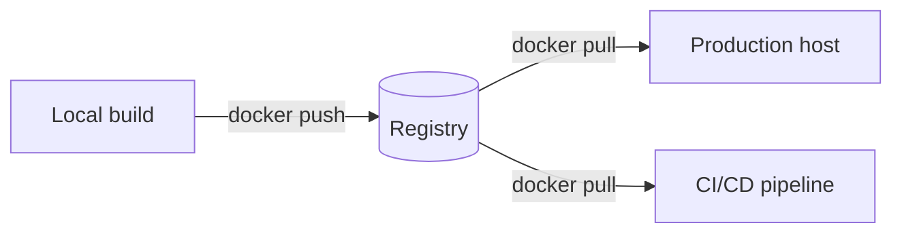

# Registries & Versioning

Where images live once they leave your machine, and how they're tracked.

## Registry Basics

A registry stores and distributes images. Docker Hub is the public default; most teams also run or use a private registry (ECR, GCR, Harbor, GitLab Registry) for internal images.



## Tagging

An image name is really `registry/repository:tag`. The tag is what makes versions distinguishable and rollbacks possible.

```bash
docker tag myapp:latest myregistry.com/team/myapp:1.4.0
docker push myregistry.com/team/myapp:1.4.0
```

| Practice | Why |
|---|---|
| Avoid relying on `:latest` in production | It's mutable and gives no rollback target |
| Use semantic versions (`1.4.0`) | Clear, comparable, predictable |
| Tag with a commit SHA in CI | Guarantees traceability back to source |

## Gotchas

- `:latest` is just a tag like any other — it doesn't mean "newest," it means "whatever was last pushed as latest."
- Pushing without authenticating (`docker login`) to the right registry fails silently into pushing to Docker Hub by default.
- Deleting a tag from a registry doesn't delete the underlying image layers if other tags reference them.

## Useful Commands

```bash
docker login myregistry.com
docker tag myapp:latest myregistry.com/team/myapp:1.4.0
docker push myregistry.com/team/myapp:1.4.0
docker pull myregistry.com/team/myapp:1.4.0
docker image rm myapp:latest
```