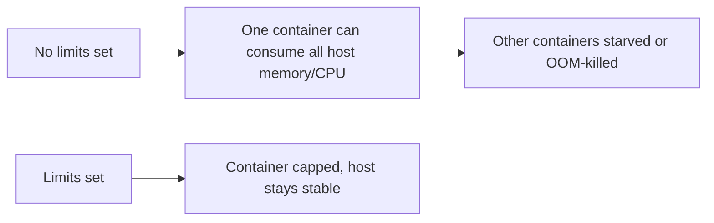

# Resource Limits & Monitoring

Controlling how much a container can consume, and watching what it actually uses.

## Setting Limits

```bash
docker run -d \
  --memory="256m" \
  --cpus="0.5" \
  myapp:latest
```

Or in Compose:

```yaml
services:
  app:
    image: myapp:latest
    deploy:
      resources:
        limits:
          memory: 256M
          cpus: "0.5"
```

## Why It Matters



Without limits, a single misbehaving container can degrade every other container on the same host — there's no isolation on resource usage by default, only on filesystem/process namespace.

## Monitoring

```bash
docker stats
```

Shows live CPU %, memory usage/limit, network I/O, and block I/O per container — the fastest way to spot a container quietly consuming more than expected.

For anything beyond ad-hoc checks, a Prometheus + cAdvisor + Grafana stack gives historical, queryable metrics instead of a live-only terminal view.

## Gotchas

- Exceeding a memory limit gets the container OOM-killed, not gracefully throttled — the process just dies.
- `docker stats` shows a live snapshot only; nothing is retained after the container stops.
- CPU limits are a share of available cores, not a guarantee — under host-wide contention, actual performance still varies.

## Useful Commands

```bash
docker stats
docker inspect --format='{{.HostConfig.Memory}}' <container>
docker update --memory="512m" --cpus="1" <container>
docker logs --since 10m <container>
```