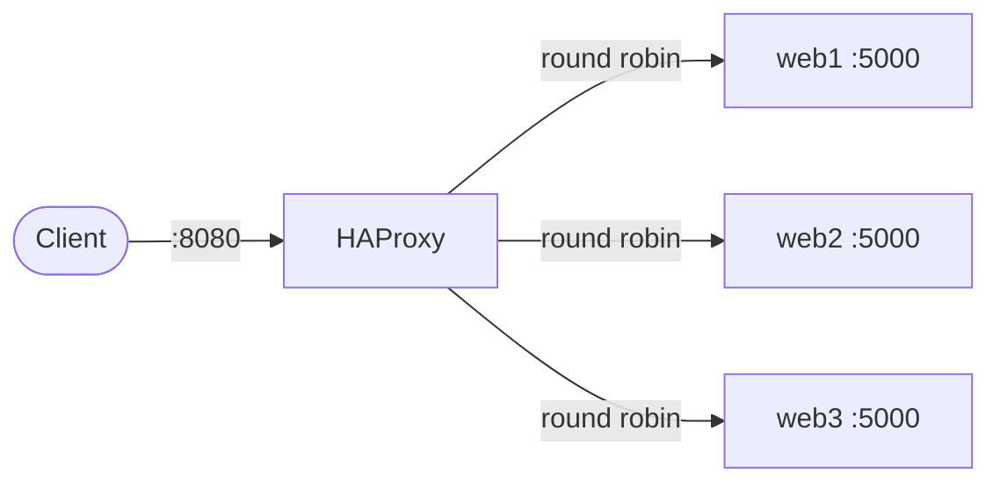

# HAProxy Load Balancer in Docker

## Overview

A single HAProxy instance distributing traffic across three identical backend containers, using round-robin balancing with active health checks.

## What We're Building

- One HAProxy container acting as the entry point
- Three backend containers, each returning their own identity so the balancing is visible
- Health checks so a dead backend is automatically taken out of rotation

## Architecture



## How It Works

- Docker Compose starts all four containers on a shared network.
- HAProxy resolves `web1`, `web2`, `web3` by service name via Docker's built-in DNS — no hardcoded IPs.
- Each backend is the same lightweight Python image, differentiated only by a `NODE_NAME` environment variable.
- HAProxy checks `/health` on each backend every few seconds; a failing backend is removed from rotation until it recovers.

## Prerequisites

- Docker and Docker Compose installed
- Port `8080` free on the host

## Getting Started

```bash
git clone https://github.com/soniajat/docker-playground.git
cd docker-playground/Hands-on/Project-01/
docker compose up --build
```

## Verifying the Load Balancing

In a separate terminal:

```bash
curl http://localhost:8080/
curl http://localhost:8080/
curl http://localhost:8080/
```

Each response should rotate between `Hello from web1`, `web2`, and `web3`.

## Testing the Health Checks

```bash
docker compose stop web2
curl http://localhost:8080/
curl http://localhost:8080/
```

Traffic should now only come from `web1` and `web3`. Bring it back with:

```bash
docker compose start web2
```

## Shutting Down

```bash
docker compose down
```

## Caveats

- `option httpchk` requires a dedicated endpoint (`/health`) — reusing `/` for health checks risks false positives if the app logic there ever changes.
- Compose's internal DNS only works for containers on the same network — this breaks if a service is moved to a separate `networks:` block without updating the others.
- Round-robin assumes backends are equally capable; a slower backend still gets an equal share of traffic.

## Possible Extensions

- Enable HAProxy's built-in stats page to watch live backend health and request counts
- Swap `balance roundrobin` for `balance leastconn` and compare behavior under uneven load
- Add TLS termination at the HAProxy layer